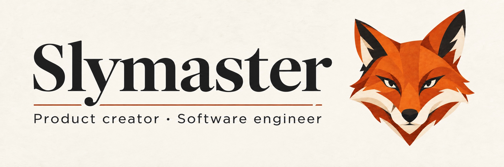

  

# Creating products. Engineering systems.

I create independent software products, drawing on **7+ years of backend engineering experience**.

My roots are in Java, Spring Boot and event-driven systems. Today, I also work on products across mobile, desktop and the web, bringing the same care to the interface and the systems behind it.

## Independent product work

Selected private projects, described without names or links to their repositories.

**Personal wardrobe · iPhone** 
A wardrobe app project for organizing clothes from photos, assembling outfits and planning looks with items already owned.

**Project workspace · Desktop & web** 
A personal workspace project that brings research, project materials and connected tools together to create and organize reusable deliverables.

**Developer platform · Web & API** 
A platform project for managing API access, tracking usage and controlling spending from a single workspace.

## Engineering foundations

**Backend:** Java, Spring Boot, REST APIs, distributed systems 
**Data & messaging:** PostgreSQL, Redis, Kafka, RabbitMQ 
**Delivery:** Docker, GitHub Actions

I care about explicit guarantees, clear transaction boundaries, reliable retries and testing what happens when things fail.

## Current focus

Building independent products, developing my Kubernetes skills through hands-on labs, and preparing for the **Certified Kubernetes Administrator (CKA)** exam.

## Public engineering work

[Blockchain Indexer Architecture Case Study](https://github.com/Slymaster/blockchain-indexer-architecture-case-study)

An architecture study covering EVM/L2 ingestion, chain reorganizations, Kafka ordering and idempotent persistence. The repository contains design documentation.

---

**Languages:** French · English · Spanish

[Email](mailto:sylvain.rey.pro@protonmail.com)
